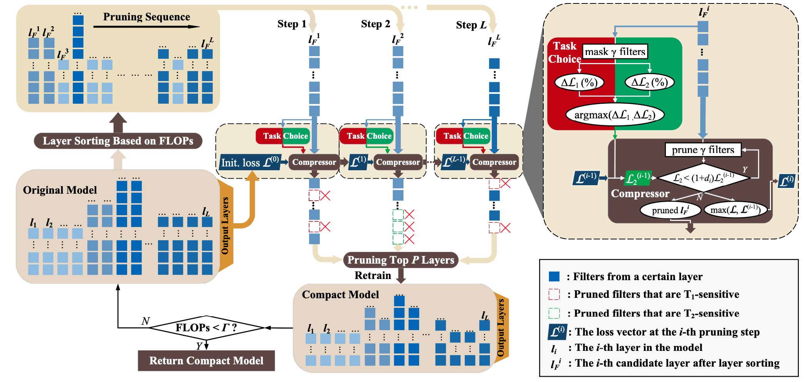

[](https://arxiv.org/abs/2303.11923)
[](https://github.com/HankYe/PAGCP/issues)
[](https://github.com/HankYe/PAGCP/pulls)

# T-PAMI-2023: Performance-aware Approximation of Global Channel Pruning for Multitask CNNs


### Introduction

This is the official implementation of PAGCP for YOLOv5 compression in the paper, [**Performance-aware Approximation of Global Channel Pruning for Multitask CNNs**](https://arxiv.org/abs/2303.11923). PAGCP is a novel pruning paradigm containing a sequentially greedy channel pruning algorithm and a performance-aware oracle criterion, to approximately solve the objective problem of GCP. The developed pruning strategy dynamically computes the filter saliency in a greedy fashion based on the pruned structure at the previous step, and control each layer’s pruning ratio by the constraint of the performance-aware oracle criterion.

### Abstract
Global channel pruning (GCP) aims to remove a subset of channels (filters) across different layers from a deep model without hurting the performance. Previous works focus on either single task model pruning or simply adapting it to multitask scenario, and still face the following problems when handling multitask pruning: 1) Due to the task mismatch, a well-pruned backbone for classification task focuses on preserving filters that can extract category-sensitive information, causing filters that may be useful for other tasks to be pruned during the backbone pruning stage; 2) For multitask predictions, different filters within or between layers are more closely related and interacted than that for single task prediction, making multitask pruning more difficult. 
Therefore, aiming at multitask model compression, we propose a Performance-Aware Global Channel Pruning (PAGCP) framework. We first theoretically present the objective for achieving superior GCP, by considering the joint saliency of filters from intra- and inter-layers. Then a sequentially greedy pruning strategy is proposed to optimize the objective, where a performance-aware oracle criterion is developed to evaluate sensitivity of filters to each task and preserve the globally most task-related filters. Experiments on several multitask datasets show that the proposed PAGCP can reduce the FLOPs and parameters by over 60\% with minor performance drop, and achieves 1.2x~3.3x acceleration on both cloud and mobile platforms

&ensp;
<p align="center">
  
</p>

### Main Results on COCO2017

[assets]: https://github.com/HankYe/PAGCP/releases

|Model |size<br><sup>(pixels) |mAP<sup>val<br>0.5:0.95 |mAP<sup>val<br>0.5  |params<br><sup>(M) |FLOPs<br><sup>640 (B)
|---                          |---  |---      |---      |---   |---
|[YOLOv5m][assets]            |640  |43.6     |62.7     |21.4  |51.3
|[YOLOv5m_pruned][assets]     |640  |41.5     |60.7     |7.7   |23.5
|[YOLOv5l][assets]            |640  |47.0     |66.0     |46.7  |115.4
|[YOLOv5l_pruned][assets]     |640  |45.5     |64.5     |16.1  |49.1
|[YOLOv5x][assets]            |640  |48.8     |67.7     |87.4  |218.8
|[YOLOv5x_pruned][assets]     |640  |47.2     |66.1     |29.3  |81.0

<details>
  <summary>Table Notes</summary>

* AP values are for single-model single-scale. **Reproduce mAP**
  by `python val.py --data coco.yaml --img 640 --weights /path/to/model/checpoints`
* All pre-trained and pruned models are trained with hyp.scratch.yaml to align the setting.

</details>
<details open>
<summary>Install</summary>

[**Python>=3.6.0**](https://www.python.org/) is required with all [requirements.txt](https://github.com/HankYe/PAGCP/blob/master/requirements.txt) installed including [**PyTorch>=1.7**](https://pytorch.org/get-started/locally/):
<!-- $ sudo apt update && apt install -y libgl1-mesa-glx libsm6 libxext6 libxrender-dev -->

```bash
$ git clone https://github.com/HankYe/PAGCP
$ cd PAGCP
$ conda create -n pagcp python==3.8 # (>=3.6)
$ pip install -r requirements.txt
```

</details>

<details open>
<summary>Compression</summary>

Repeatedly run the command below to prune models on [COCO](https://github.com/HankYe/PAGCP/blob/master/data/scripts/get_coco.sh) dataset, in which hyper-parameters can be tuned to get better compression performance.

```bash
$ python compress.py --model $model name$ --dataset COCO --data coco.yaml --batch 64 --weights /path/to/to-prune/model --initial_rate 0.06 --initial_thres 6. --topk 0.8 --exp --device 0
```

</details>

<details open>

<summary>Export</summary>

We have tested the effectiveness of ONNX-format conversion. The command is as follows:

```bash
$ python export.py --weights $weight_path$ --include onnx --dynamic
```

</details>

### Citation
If you find this work helpful in your research, please cite.
````
@article{ye23pagcp,
  title={Performance-aware Approximation of Global Channel Pruning for Multitask CNNs},
  author={Hancheng Ye and Bo Zhang and Tao Chen and Jiayuan Fan and Bin Wang},
  journal={IEEE Transactions on Pattern Analysis and Machine Intelligence},
  year={2023}
}
````

### Acknowledgement
We greatly acknowledge the authors of _YOLOv5_ and _Torch_pruning_ for their open-source codes. Visit the following links to access more contributions of them.
* [YOLOv5](https://github.com/ultralytics/yolov5)
* [Torch_pruning](https://github.com/VainF/Torch-Pruning)
